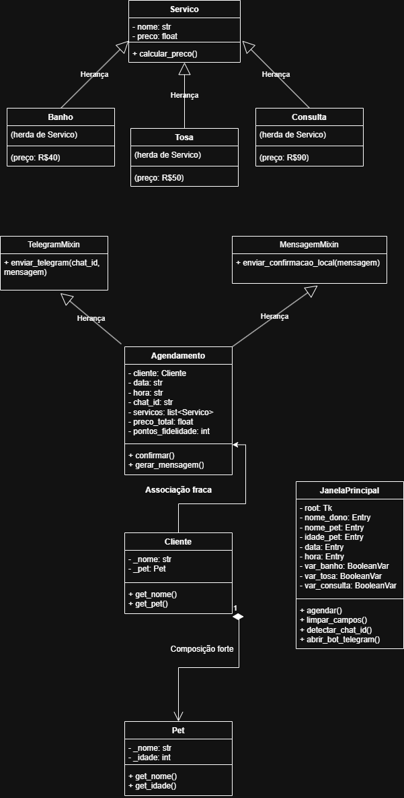

# 🐾 Petshop - Projeto Livre Python com Tkinter

Este projeto simula um sistema de agendamento de serviços para um Petshop com interface gráfica em Python, envio de mensagens via bot do Telegram, cálculo automático de orçamento e sistema de pontos de fidelidade.

## 🎯 Objetivo
Permitir que usuários agendem serviços como *banho*, *tosa* ou *consulta* para seus pets.


## ✅ Funcionalidades

- [x] Cadastro de dono e pet
- [x] Interface gráfica 
- [x] Escolha de serviços (pode selecionar mais de um)
- [x] Validação de dados (nome, idade, data, hora)
- [x] Horário de funcionamento: das *08h às 18h*
- [x] Preço calculado automaticamente com base nos serviços
- [x] Sistema de fidelidade: *10 pontos por serviço*
- [x] Envio de mensagem automática via bot do Telegram
- [x] Salvamento local em `agendamentos.json`
- [x] Listagem de agendamentos direto na interface


## 💰 Tabela de Preços

| Serviço   | Preço  |
|-----------|--------|
| Banho     | R$ 40  |
| Tosa      | R$ 50  |
| Consulta  | R$ 90  |

## 🧠 Sistema de Fidelidade

O sistema de fidelidade funciona da seguinte forma:

- Cada serviço agendado acumula *10pontos*
- Por exemplo:
  - 1 serviço = 10 pontos
  - 3 serviços = 30 pontos
- A pontuação aparece na mensagem enviada
- Pode ser usado para um programa de descontos futuro

## 🧾 Exemplo de Mensagem Enviada

🐾 Agendamento Confirmado!
Cliente: Ana Silva
Pet: Thor (3 anos)
Serviços: Banho, Consulta
Data: 24/05/25 às 14:00
Valor total: R$ 130.00
🎁 Pontos de fidelidade: 20


## 📦 Requisitos

- Python 3.10 ou superior
- Biblioteca `requests` (para usar a API do Telegram)
- pip install requests
## 📥 Instalação

1. Clone o repositório:

```bash
git clone https://github.com/DaviUrsulino/Petshop.git
cd Petshop

## 📥 Rodar

- executar a main.py

## 📥 Como usar o Bot do Telelegram

-Acesse: 👉 @PetshoTrabalho_bot
-Envie a mensagem /start
-Volte ao programa e clique em Agendar
-O sistema detectará seu chat ID automaticamente
-A confirmação será enviada via Telegram
## 📥 agendamentos.json

[
  {
    "cliente": "Ana",
    "pet": "Thor",
    "idade": "3",
    "data": "24/05/25",
    "hora": "14:00",
    "servicos": ["Banho", "Consulta"]
  }
]
exemplo

## 📥 Organização do Projeto

Petshop/
├── main.py
├── agendamentos.json
├── README.md
└── package/
    ├── interface/
    │   └── janela.py
    ├── models/
    │   ├── cliente.py
    │   ├── pet.py
    │   └── servico.py
    ├── services/
    │   └── agendamento.py
    └── utils/
        ├── telegram_bot.py
        ├── validacoes.py
        └── mixins.py


## 📌 Observações Técnicas

- O projeto usa orientação a objetos  com:
  - Herança (Banho, Tosa e Consulta herdam de Serviço)
  - Polimorfismo (método `calcular_preco` sobrescrito em cada serviço)
  - Encapsulamento (atributos protegidos com `_` e acesso via `@property`)
  - Mixins (TelegramMixin e MensagemMixin reutilizados no Agendamento)
  - Composição forte (Cliente possui Pet)
  - Associação fraca (Agendamento conhece Cliente, mas não o contrário)

  s

## 📊 Diagrama UML do Projeto

Abaixo está o diagrama UML representando as principais classes e relações do sistema:



feito no Draw.io


